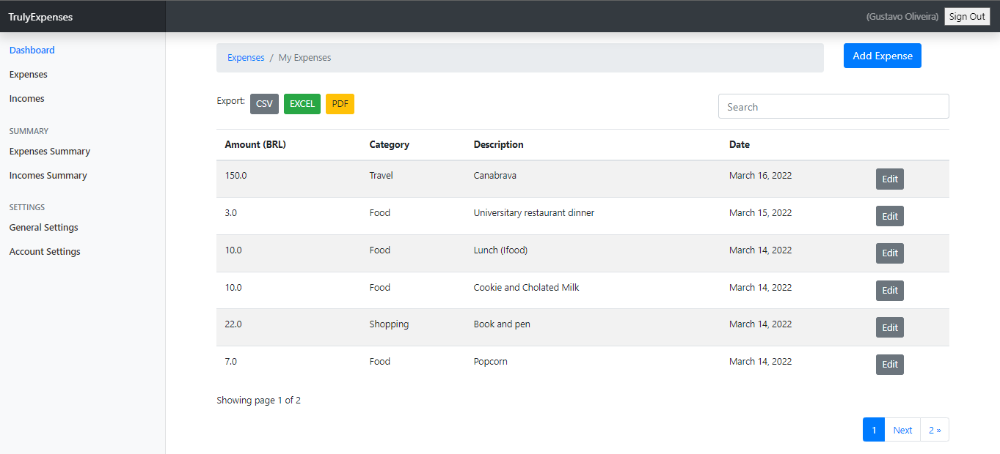
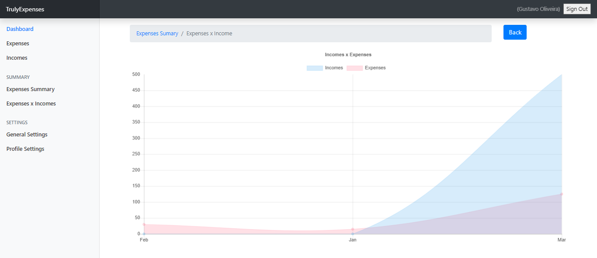

<div align="center" id="top"> 
  
  &#xa0;
  <!-- <a href="https://incomeexpensewebsite.netlify.com">Demo</a> -->
</div>

<h1 align="center">TrulyExpenses Website</h1>

<!-- Status -->

 <h4 align="center"> 
	🚧  Em construção...  🚧
</h4> 

<hr> 

<p align="center">
  <a href="#dart-sobre">Sobre</a> &#xa0; | &#xa0; 
  <a href="#sparkles-funcionalidades">Funcionalidades</a> &#xa0; | &#xa0;
  <a href="#rocket-tecnologias">Tecnologias</a> &#xa0; | &#xa0;
  <a href="#white_check_mark-pré-requisitos">Pré requisitos</a> &#xa0; | &#xa0;
  <a href="#checkered_flag-começando">Começando</a> &#xa0; | &#xa0;
  <a href="https://github.com/{{YOUR_GITHUB_USERNAME}}" target="_blank">Autor</a>
</p>

<br>

## :dart: Sobre ##

O TrulyExpenses é uma plataforma desenvolvida utilizando o Framework Django do Python com a função de ser um gestor dos ganhos e gastos mensais do usuário para uma gestão da própria econômia.

Plataforma disponível para uso em: [http://expenses.sistemifica.com.br](http://expenses.sistemifica.com.br)

<div align="center"> 
  
  &#xa0;
</div>

<div align="center"> 
  
  &#xa0;
</div>

<div align="center"> 
  
  &#xa0;
</div>

## :sparkles: Funcionalidades ##

:heavy_check_mark: Cadastro com confirmação de e-mail;\
:heavy_check_mark: Validação de usuário e e-mail durante o cadastro;\
:heavy_check_mark: Recuperação de senha com e-mail;\
:heavy_check_mark: CRUD para gerenciamento dos gastos _(expenses)_;\
:heavy_check_mark: Busca dinâmica na listagem de gastos;\
:heavy_check_mark: CRUD para gerenciamento dos ganhos _(incomes)_;\
:heavy_check_mark: Painel administrativo custimizado;\
:heavy_check_mark: Painél de gráficos com ChartsJS;\
:heavy_check_mark: Exportação dos gastos para CSV, EXCEL e PDF;\


## :rocket: Tecnologias ##

As seguintes ferramentas foram usadas na construção do projeto:

- [Django](https://www.djangoproject.com/)
- [Virtualenv](https://virtualenv.pypa.io/en/latest/)
- [Charts JS](https://www.chartjs.org/)
- [WeasyPrint](https://weasyprint.org/)


## :white_check_mark: Pré requisitos ##

Antes de começar :checkered_flag:, você precisa ter o [Git](https://git-scm.com), o [Python](https://www.python.org/), a biblioteca  [Virtualenv](https://virtualenv.pypa.io/en/latest/) e o [WeasyPrint](https://weasyprint.org/) instalados em sua maquina.

## :checkered_flag: Começando ##

```bash
# Clone este repositório
$ git clone https://github.com/gustaoliv/Django-TrulyExpenses.git

# Entre na pasta
$ cd Django-TrulyExpenses

# Criação da Virtualenv
$ virtualenv venv

# Ativação da Virtualenv
$ /venv/Scripts/activate

# Instalação das dependências
$ pip install -r requirements.txt

# Iniciando aplicação
$ python manage.py runserver

# O site vai inicializar em <http://localhost:8000>
```

## :memo: Licença ##

Feito com :heart: por <a href="https://github.com/gustaoliv" target="_blank">Gustavo Oliveira</a>

&#xa0;

<a href="#top">Voltar para o topo</a>


## :memo: Créditos ##

Projeto desenvolvido juntamente com o canal: [Cryce Truly](https://www.youtube.com/c/CryceTruly)